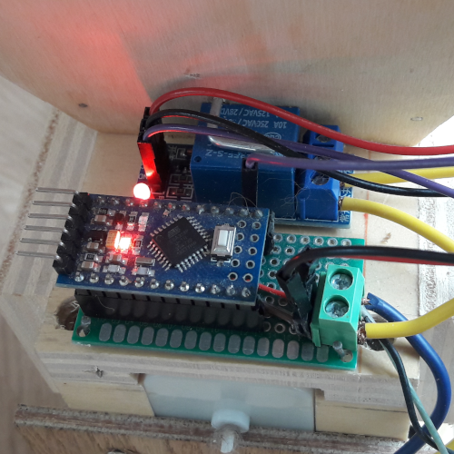

<!-- markdownlint-disable MD033 -->
# Automatic Croquette Feeder

This repository host all files necessary to build a automatic cat croquette feeder for less than 10 €.

<video width="700" height="500" controls>
  <source src="./media/catFeeder.mp4" type="video/mp4">
</video>

## Problematic

As obligate carnivores, cats have unique nutritional requirements that must be met through their diet. Unlike humans and some other animals, cats require a high amount of protein in their diet, as well as certain essential amino acids and fatty acids that can only be obtained through animal-based sources.

In addition to their unique nutritional needs, cats have a fast metabolism and a small stomach capacity, which means they need to eat more frequently throughout the day to maintain their energy levels and avoid overeating. When cats are fed only once or twice a day, they may become ravenously hungry, leading them to overeat or binge on food, which can result in digestive issues, obesity, and other health problems.

Furthermore, cats are natural hunters and have a strong instinct to hunt and catch prey. When they are fed only at specific times of the day, they may become bored or frustrated, leading to behavioral problems such as aggression, anxiety, and destructive behavior.

In summary, feeding cats a regular, balanced diet that meets their nutritional needs and providing frequent access to food throughout the day is crucial for their physical and mental health.

One solution is the use of automatic feeder. These feeders can be set to dispense food at specific times or intervals. Automatic feeders can also be helpful for cats who are prone to overeating or obesity. By dispensing small, controlled portions of food throughout the day, automatic feeders can help prevent cats from consuming too much food at once and regulate their caloric intake.

But they also have many disadvantages. They are costly and poorly customizable. The ration is most of the time fixed and you can't serve really small amount or a great number of time.

## Solution

The solution I went for is as follow:
|||
|--|--|
| 1. A tank made of wood contains a 5 days equivalent of croquette. |  |
| 2. The croquette fall in a tube. |  |
| 3. An endless screw push them to the exit |  |
| 4. This screw is motorised by a gear reducer motor |  |
| 5. The motor is controlled via a relay module and an arduino mini. |  |
| 6. The later is turned on a set amount of time per day via a 24 hours mechanical plug timer. |  |

## How to build it ?

For a 3D image of the feeder you can look at the [feeder_turning](./media/catFeeder_turntable.html).

This croquette feeder is composed of four steps:

- 3D printing
- Wood building
- Electronic
- Final assembly

### 3D printing

Two parts are 3D printed:

- The main tube that will guide the croquettes.
- The endless screw that will push the croquettes through the tube.

The files need for the printing are available here [/building/toPrint/](./building/toPrint/).

The endlessScrew head may need to be modified to adapt to your motor head.

### Wood building

This part is up to you. It depends on your needs, tools, skills, ...
Here is an example of what I've made (pieces A, B and E are duplicated).
Piece F is a cover for the tank.
The size of the tank is enough for 5 days of croquettes.

### Electonic

For the cat feeder to work you'll need:

- Arduino board (a mini is sufficient)
- A relay (easiest is a relay module)
- A motor with a reductor (you can reuse one from old toy)
- A 5V charger
- A mechanical plug timer

The eletronic shema is as follow:

You can find also the board file in the folder [/building/electronic/circuit.brd](./building/electronic/circuit.brd).

### Code

The code can be found in the [code folder](./code/catFeeder.ino).
It's quite simple.
The code define the pin which is connected to the relay controller, the time for a full day portion of croquette and the number of meal you want to serve during one day.
You can customize those variable depending of your setup.

## Durability / Fiability

This system has been working for our cat since 3 years now.
At the start the motor continued to turned without stopping randomly during the month.
It stopped when we mooved (it was maybe caused by tension instability).

## Improvement possible

### Customisation of the time on the fly

The time for the full dose could be dependant of the tension obtained via a potentiometer.

# Licence

The content of this project itself is licensed under the [Creative Commons Attribution 3.0 Unported license](LICENSE_GNU_GPLv3), and the underlying source code used to format and display that content is licensed under the [MIT license](LICENSE_MIT).